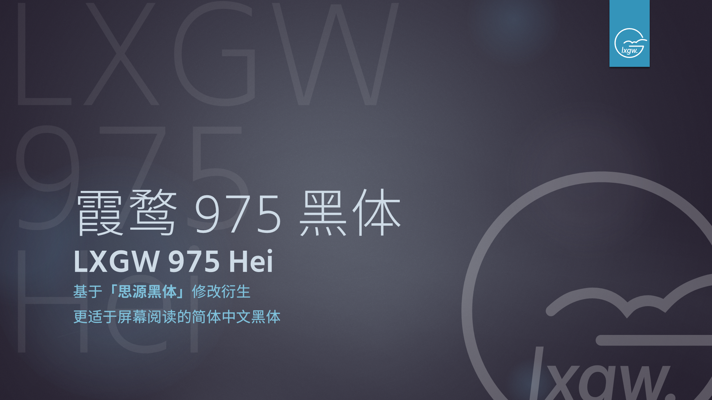
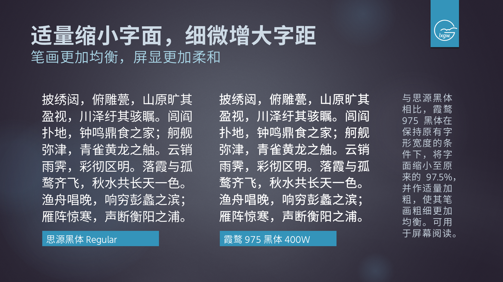
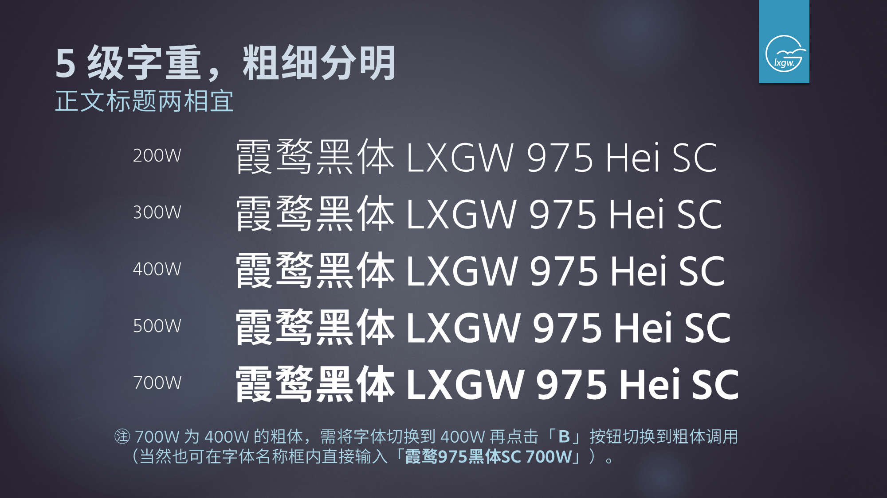
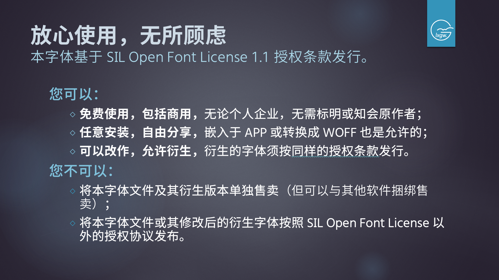
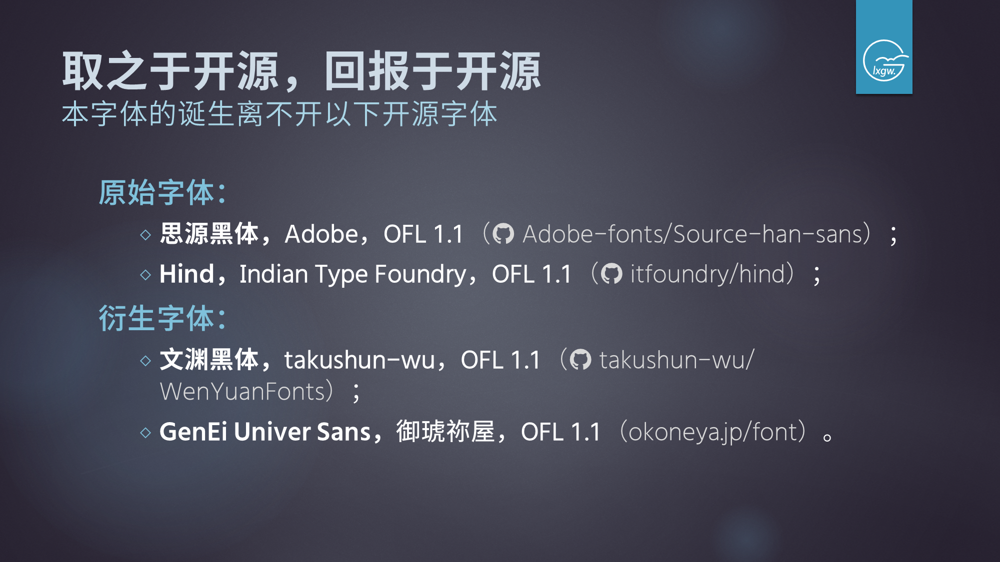

<!--
> [!IMPORTANT]
> 本字体已经放弃维护。请您选用原版「思源黑体」或其他作者基于思源黑体衍生的字体。
-->
# 975 黑体 / 975 Hei
A Chinese Font Derived from Source Han Sans. 一款基于思源黑体的中文字体。

## 简介
在思源黑体的基础上进行调整。在保持原有字符宽度的同时，缩小字面至 97.5%，并做少许加粗，使其更适合手机屏幕阅读。

西文搭配经过调整处理的 [GenEi Univer Sans](https://okoneya.jp/font/download.html#dl-geus) 字体。

目前只有简体中文（SC）版本，剔除 'locl' 特性以减小字体体积。包含基本区和扩展 A 区所有汉字，以及扩展 B～E 区《通用规范汉字表》汉字（扩展区可能还包含一部分与增补部首区字符同形的字），满足 GB 18030-2022 实现级别 2 的收字范围。

## 预览

## 注意事项
- 这不是一个专业的字体文件。
- 700W 作为 400W 的粗体，在 Office 等软件中需将字体切换到 400W 再点击「**Ｂ**」按钮切换到粗体调用（当然也可在字体名称框内直接输入「霞鹜975黑体SC 700W」）。
- 已知问题：
  - 对于引号、省略号、1 em 横线等中英文共用标点的取舍问题尚未解决。本字体引号采用 Unicode 16.0 标准化变体序列（Standardized Variation Sequences, SVS）在西文引号  `“‘’”` 和中文引号 `“︁‘︁’︁”︁` 之间选择，省略号和 1 em 横线（半破折号）使用西文字体的字符。
  - 在 Word (Microsoft 365）中，400 字重可能无法正常调用，该问题与字体的安装先后顺序有关，如果先安装 700W，再安装 400W，在 Word 中则只会调用先安装的粗体，「975 圆体」亦然。因此在安装过程中，需注意先安装 400W 常规体，后安装 700W 粗体和其他字重。

## 授权信息
本字体依照 SIL Open Font License 1.1 授权许可发布，您可以： 
- 免费使用，包括商用，无需付费、告知或标明原作者；
- 自由分享字体文件，并将其安装在任何软件/设备中；
- 在此基础上进行修改或二次创作，但改作后的字体也应遵循 SIL OFL 1.1 条款开源发布。

惟需注意以下条件：
- 在制作衍生字体时，字体名称不可使用原有字体的「保留名称」。本字体保留名称「霞鹜」「LXGW」「975」，基于本字体二次衍生的字体，名称不可出现「霞鹜」「LXGW」或「975」字样；而在没有对字体源代码进行修改的情况下，重新编译出来的字体，可以继续使用上述名称。
- 根据 [SIL Open Font License 1.1](https://openfontlicense.org)「许可与条件」中第 1 条的规定， **禁止单独出售字体文件（OTF/TTF 文件）的行为。**
- 该字体不可在 [SIL Open Font License 1.1](https://openfontlicense.org) 以外的授权许可下发行。

## 字体下载
1. 点击【Clone or download】->【Download ZIP】下载 ZIP 格式压缩包，或者在文件列表中选择想要的字体文件进行下载。
2. 进入 [Release](https://github.com/lxgw/975Hei/releases) 页面下载 TTF 文件。
3. 进入 [猫啃网](https://www.maoken.com/freefonts/6327.html) 下载，GitHub 项目更新后，会联系猫啃网站长进行同步更新。 **注意：** 其它收录免费商用字体的网站上可能也收录了本字体，但可能不是最新版。
4. [蓝奏云下载 ~~Magisk 模块~~，密码 bquo](https://www.lanzoux.com/b0cqi3x9c)

## 鸣谢
- [思源黑体 / Source Han Sans](https://github.com/adobe-fonts/source-han-sans) *by Adobe*
- [Noto Sans CJK](https://github.com/googlefonts/noto-cjk) *by Google*
- [Hind](https://github.com/itfoundry/hind) *by Indian Type Foundry*
- [GenEi Univer Sans](https://okoneya.jp/font/download.html#dl-geus) *by Okoneya（御琥祢屋）*

## 相关项目
### 975 系列
- [975 圆体 / 975 Yuan](https://github.com/lxgw/975Yuan)
### 更多开源字体
- [点击此处 / Click Here](https://github.com/lxgw/lxgw/blob/main/fonts.md)

## 联系作者

- **Telegram：** @lxgwtg
- **微信公众号：** 霞鹜 *（ID: lxgwshare）*
- **酷安：** [@落霞孤鹜lxgw](https://www.coolapk.com/u/633884)
- **微博：** [@孤鹜先森](https://weibo.com/6624339726)

